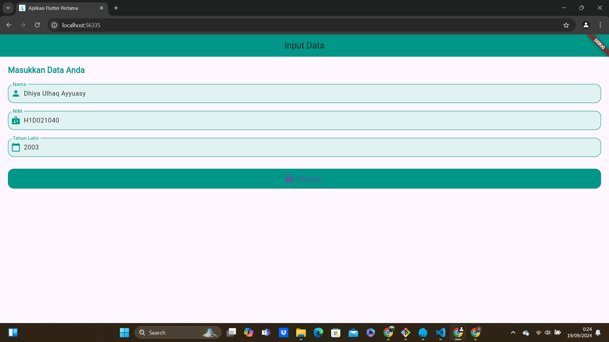
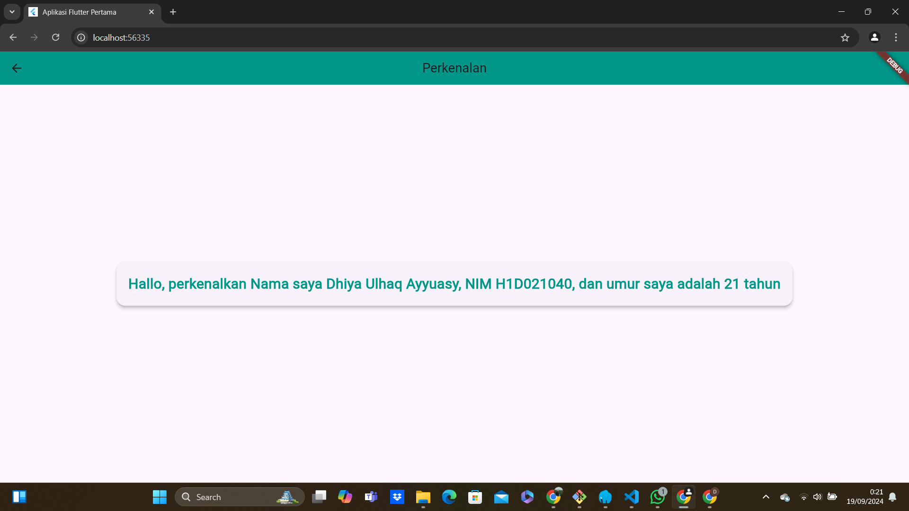

# Tugas Pertemuan 2

Nama : Dhiya Ulhaq Ayyuasy
NIM : H1D021040
Shift Baru: D

## Screenshot
Contoh :

1. Terdapat proses inputan. Terdapat pada Text Field yang dibuat untuk menerima input pengguna (nama, NIM, dan tahun lahir). Setiap text field memiliki kontrol yang dihubungkan dengan controller masing-masing, yang berarti setiap input yang dilakukan pengguna secara otomatis disimpan di dalam controller.
2. Saat pengguna mengetik di text field, controller secara otomatis menyimpan nilai yang dimasukkan. Pengguna dapat menginput:
Nama di TextField nama (dikendalikan oleh _namaController).
NIM di TextField NIM (dikendalikan oleh _nimController).
Tahun lahir di TextField tahun lahir (dikendalikan oleh _tahunController).
3. Proses Validasi dan simpan data Ketika pengguna menekan tombol Simpan, proses pengambilan data dari masing-masing TextField, dari kode  di bawah 
onPressed: () {
  String nama = _namaController.text;
  String nim = _nimController.text;
  int tahun = int.parse(_tahunController.text);
  Navigator.of(context).push(
      MaterialPageRoute(
          builder: (context) => TampilData(nama: nama, nim: nim, tahun: tahun)
      )
  );
},
Proses ini melibatkan:
Mengambil teks yang dimasukkan pengguna dari controller masing-masing.
Konversi teks tahun lahir ke tipe int menggunakan int.parse().
Melakukan navigasi ke halaman lain (TampilData) untuk menampilkan data yang telah dimasukkan.
4. Setelah tombol Simpan ditekan dan data diambil, proses navigasi dilakukan menggunakan code: 
Navigator.of(context).push(MaterialPageRoute(
    builder: (context) => TampilData(nama: nama, nim: nim, tahun: tahun)));
Proses ini mengirim data (nama, NIM, dan tahun) ke halaman TampilData, yang mungkin bertugas menampilkan kembali data yang telah diinputkan oleh pengguna.
Navigator.push() digunakan untuk berpindah ke halaman baru, menambahkan halaman baru di atas halaman saat ini di stack navigasi.